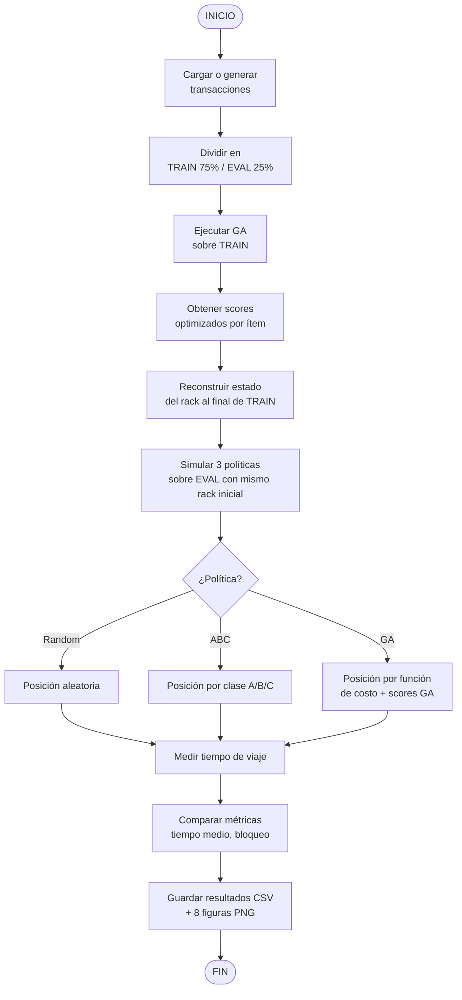
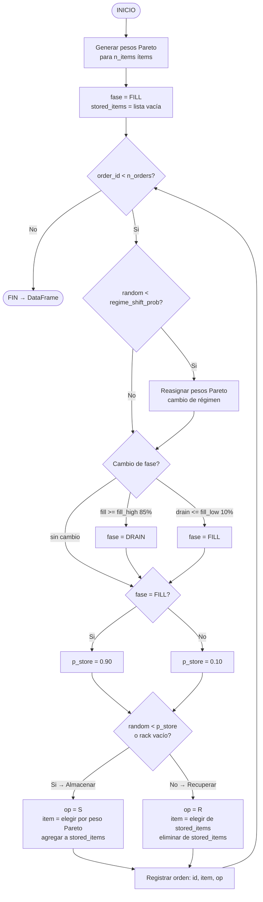
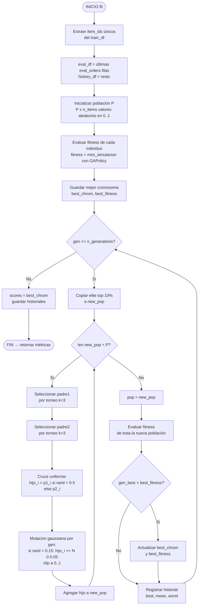
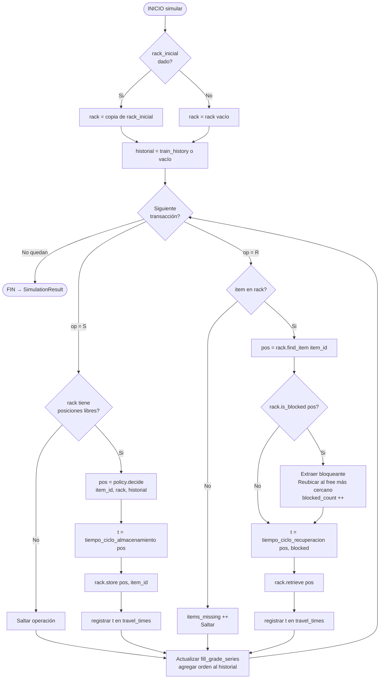
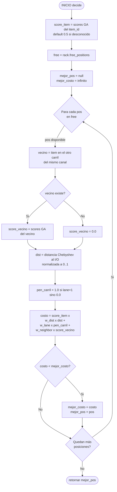
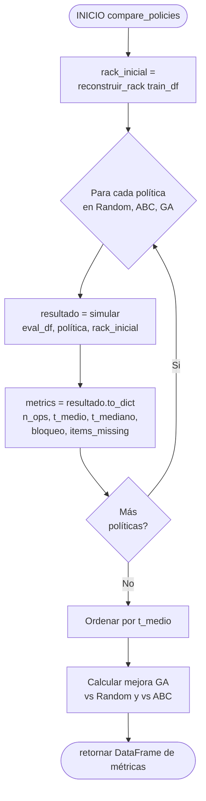
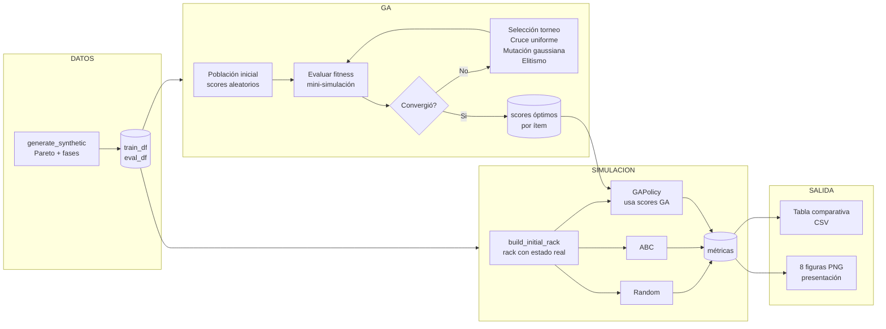

# Diagramas de Flujo y Pseudocódigos — AS/RS + GA

Documento de referencia para entender el funcionamiento interno del sistema.  
Los diagramas usan sintaxis **Mermaid** (renderizan en GitHub, VS Code con extensión, o [mermaid.live](https://mermaid.live)).

---

## Índice

1. [Flujo general del experimento](#1-flujo-general-del-experimento)
2. [Generación de datos sintéticos](#2-generación-de-datos-sintéticos)
3. [Algoritmo Genético (GA)](#3-algoritmo-genético-ga)
4. [Motor de simulación](#4-motor-de-simulación)
5. [Política de asignación GAPolicy](#5-política-de-asignación-gapolicy)
6. [Comparación de políticas](#6-comparación-de-políticas)

---

## 1. Flujo general del experimento

### Diagrama de flujo



### Pseudocódigo

```
EXPERIMENTO_PRINCIPAL(csv_path = null):

  1. DATOS
     si csv_path != null:
         df = cargar_CSV(csv_path)
     sino:
         df = generar_sintetico(n_ordenes=2000, n_items=60)

  2. PARTICION TEMPORAL (sin shuffle)
     train_df = df[ : 75% ]
     eval_df  = df[ 75% :  ]

  3. OPTIMIZACION GA
     optimizer = DemandOptimizerGA(config_ga)
     ga_metrics = optimizer.fit(train_df)
     scores = optimizer.scores          // {item_id -> score en [0,1]}

  4. ESTADO INICIAL DEL RACK
     rack_inicial = reconstruir_rack(train_df)

  5. SIMULACION COMPARATIVA
     para cada politica en {Random, ABC, GA}:
         resultado = simular(eval_df, politica, rack_inicial)

  6. RESULTADOS
     imprimir tabla comparativa
     guardar CSV y figuras
```

---

## 2. Generación de datos sintéticos

### Diagrama de flujo



### Pseudocódigo

```
GENERAR_SINTETICO(n_items, n_orders, pareto_alpha, regime_shift_prob):

  pesos = Pareto(pareto_alpha, n_items) + 1
  pesos = pesos / suma(pesos)              // normalizar a distribución

  stored_items = []
  fase = "FILL"

  para order_id = 0 hasta n_orders - 1:

    // Posible cambio de régimen
    si aleatorio() < regime_shift_prob:
        pesos = nuevo_Pareto(pareto_alpha, n_items)

    fill_actual = len(stored_items)

    // Cambio de fase
    si fase == "FILL"  y fill_actual >= 0.85 * capacidad:
        fase = "DRAIN"
    si fase == "DRAIN" y fill_actual <= 0.10 * capacidad:
        fase = "FILL"

    p_store = 0.90 si fase == "FILL" sino 0.10

    si aleatorio() < p_store o stored_items vacio:
        op      = "S"
        item_id = muestrear(n_items, probabilidades=pesos)
        stored_items.agregar(item_id)
    sino:
        op      = "R"
        item_id = muestrear(stored_items, probabilidades=pesos[stored_items])
        stored_items.eliminar(item_id)

    registros.agregar({order_id, item_id, op})

  retornar DataFrame(registros)
```

---

## 3. Algoritmo Genético (GA)

### Diagrama de flujo



### Pseudocódigo

```
GA_FIT(train_df, rack_cfg, crane_cfg, cost_weights):

  item_ids = items_unicos(train_df)
  n_items  = len(item_ids)

  eval_df    = train_df[ ultimas eval_orders filas ]
  history_df = train_df[ resto ]

  // ── Inicialización ─────────────────────────────────────────────
  poblacion = matriz_aleatoria(filas=pop_size, cols=n_items)  // valores en [0,1]

  FITNESS(cromosoma):
      scores  = {item_i: cromosoma[i] para cada item_i}
      policy  = GAPolicy(scores)
      result  = simular(eval_df, policy, history_df)
      retornar promedio(result.travel_times)

  fitness = [FITNESS(ind) para ind en poblacion]

  mejor_cromosoma = poblacion[ argmin(fitness) ]
  mejor_fitness   = min(fitness)
  historial_mejor = [mejor_fitness]

  // ── Ciclo evolutivo ────────────────────────────────────────────
  para gen = 1 hasta n_generations:

    nueva_pop = []

    // Elitismo: preservar el 10% mejor
    elite = poblacion[ argsort(fitness)[:pop_size//10] ]
    nueva_pop.agregar(elite)

    // Completar el resto con descendencia
    mientras len(nueva_pop) < pop_size:

        padre1 = TORNEO(poblacion, fitness, k=3)
        padre2 = TORNEO(poblacion, fitness, k=3)

        // Cruce uniforme
        hijo = []
        para i = 0 hasta n_items - 1:
            si aleatorio() < 0.5:
                hijo[i] = padre1[i]
            sino:
                hijo[i] = padre2[i]

        // Mutación gaussiana
        para i = 0 hasta n_items - 1:
            si aleatorio() < mutation_rate:
                hijo[i] = clip(hijo[i] + N(0, mutation_sigma), 0, 1)

        nueva_pop.agregar(hijo)

    poblacion = nueva_pop
    fitness   = [FITNESS(ind) para ind en poblacion]

    si min(fitness) < mejor_fitness:
        mejor_fitness   = min(fitness)
        mejor_cromosoma = poblacion[ argmin(fitness) ]

    historial_mejor.agregar(mejor_fitness)

  scores = {item_i: mejor_cromosoma[i]}
  retornar {scores, mejor_fitness, historial_mejor, ...}


TORNEO(poblacion, fitness, k):
  candidatos = muestra_aleatoria(poblacion, k)
  retornar candidato con menor fitness
```

---

## 4. Motor de simulación

### Diagrama de flujo



### Pseudocódigo

```
SIMULAR(df, policy, rack_cfg, crane_cfg, train_history, rack_inicial):

  rack      = copia(rack_inicial)  // mismo punto de partida para todas las políticas
  historial = train_history.copia()
  resultado = SimulationResult()

  para cada orden en df:
      item_id  = orden.item_id
      op       = orden.operation

      si op == "S":
          si rack.libre() == vacio: continuar

          pos = policy.decide(item_id, rack, historial)
          t   = storage_cycle_time(pos)
          rack.store(pos, item_id)
          resultado.travel_times.agregar(t)

      si op == "R":
          pos = rack.find_item(item_id)
          si pos == null:
              resultado.items_missing ++
              continuar

          bloqueado = rack.is_blocked(pos)

          si bloqueado:
              pos_ext    = (pos.col, pos.row, lane=0)
              bloqueante = rack.get_item(pos_ext)
              rack.retrieve(pos_ext)
              libre_mas_cercano = min(rack.free_positions(), distancia_a_pos)
              rack.store(libre_mas_cercano, bloqueante)
              resultado.blocked_count ++

          t = retrieval_cycle_time(pos, bloqueado)
          rack.retrieve(pos)
          resultado.travel_times.agregar(t)

      resultado.fill_grade_series.agregar(rack.fill_grade)
      historial.agregar(orden)

  retornar resultado
```

---

## 5. Política de asignación GAPolicy

### Diagrama de flujo



### Pseudocódigo

```
GAPOLICY_DECIDE(item_id, rack, scores, pesos):

  score_item = scores.get(item_id, 0.5)
  libres     = rack.free_positions()

  mejor_pos  = null
  mejor_costo = +infinito

  para cada pos en libres:

      // Obtener score del ítem vecino en el mismo canal
      vecino       = rack.neighbor_item(pos)
      score_vecino = scores.get(vecino, 0.0) si vecino != -1 sino 0.0

      // Componentes del costo
      dist      = distancia_IO_normalizada(pos)   // en [0, 1]
      pen_carril = 1.0 si pos.lane == 1 sino 0.0

      costo = score_item * (
                  pesos.w_distance * dist
                + pesos.w_lane     * pen_carril
                + pesos.w_neighbor * score_vecino
              )

      si costo < mejor_costo:
          mejor_costo = costo
          mejor_pos   = pos

  retornar mejor_pos


// Intuición:
//   - score_item alto  → ítem muy demandado → acumula costo en pos lejanas
//     → el minimizador lo empuja a posiciones cercanas al I/O y carril exterior
//   - score_vecino alto → el vecino es muy demandado → asignar aquí bloquearía
//     su recuperación → el costo sube → se evita esa posición
```

---

## 6. Comparación de políticas

### Diagrama de flujo



### Pseudocódigo

```
COMPARE_POLICIES(eval_df, politicas, train_history):

  // Estado inicial idéntico para todas las políticas (comparación justa)
  rack_inicial = BUILD_INITIAL_RACK(train_history)

  resultados = []

  para cada (nombre, politica) en politicas:
      res = SIMULAR(eval_df, politica, rack_inicial=rack_inicial)
      resultados.agregar({
          policy:              nombre,
          mean_travel_time:    promedio(res.travel_times),
          median_travel_time:  mediana(res.travel_times),
          total_travel_time:   suma(res.travel_times),
          blocking_rate:       res.blocked_count / res.retrieval_count,
          items_missing:       res.items_missing
      })

  retornar DataFrame(resultados)


BUILD_INITIAL_RACK(train_df):
  // Reproduce la secuencia de entrenamiento con política aleatoria fija
  // para obtener el estado real del rack al terminar el entrenamiento

  rack = RackState(vacio)
  rng  = aleatorio(seed=0)

  para cada orden en train_df:
      si orden.op == "S":
          pos = rack.free_positions()[ aleatorio() ]
          rack.store(pos, orden.item_id)

      si orden.op == "R":
          pos = rack.find_item(orden.item_id)
          si pos == null: continuar
          si rack.is_blocked(pos):
              ext    = (pos.col, pos.row, lane=0)
              bloq   = rack.get_item(ext)
              rack.retrieve(ext)
              rack.store(rack.free_positions()[0], bloq)
          rack.retrieve(pos)

  retornar rack
```

---

## Resumen visual del sistema completo


